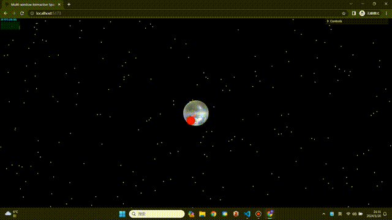

# ACG-final-assignment


This is the final group project for [Advanced Course in Computer Graphics](https://esslab.jp/~ess/en/teaching/2023/acg/) course at Waseda University. 

Metal Planet: Multi-window Interactive Space Simulation

Demo &#8595;



Multi-balls reflection &#8595;


## Getting Started

### Prerequisites
Before you begin, ensure you have the latest version of Node.js installed on your system. You can download it from [Node.js official website](https://nodejs.org/).

### Installation

1. **Clone the Repository**

   Gain a local copy of the project by cloning the repository using the following command:

   ```bash
   git clone https://github.com/ruijieren98/ACG-final-assignment.git
   cd ACG-final-assignment
   ```

2. **Install Dependencies**

    Install Three.js and other necessary dependencies as follows:

    For Three.js, refer to the official [installation guide](https://threejs.org/docs/index.html#manual/en/introduction/Installation) or simply run:
    ```
    npm install --save three
    ```
    
    For Vite, a frontend build tool, install it using:
    ```
    npm install --save-dev vite
    ```

### Running the Project

1. **Start the Server:**

   In the project directory, start the server by running:

   ```bash
   cd ACG-final-assignment/multipleWindow3dScene
   npx vite
   ```

2. **Open the Application:**

   Open a web browser and navigate to http://localhost:5173/ or use the URL provided in the terminal output. For optimal experience and to prevent cache-related issues, it is recommended to use the browser in incognito mode.


## Acknowledgements
This project builds upon and enhances the foundational work available at [bgstaal/multipleWindow3dScene](https://github.com/bgstaal/multipleWindow3dScene/). We extend our sincere gratitude to the original authors for their innovative and inspiring contributions, which have been instrumental in shaping the development of this project.